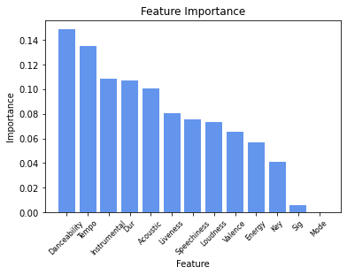
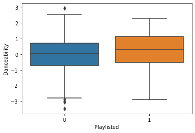
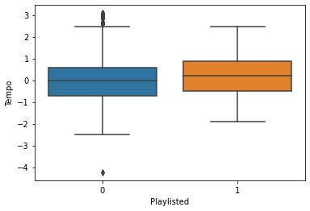
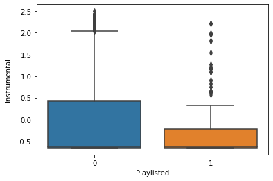
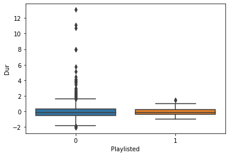
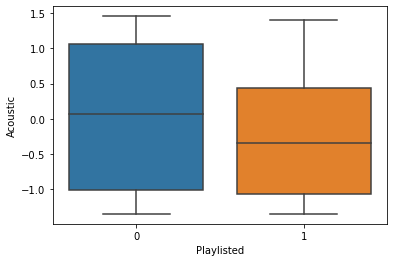
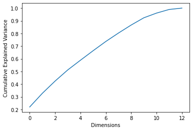
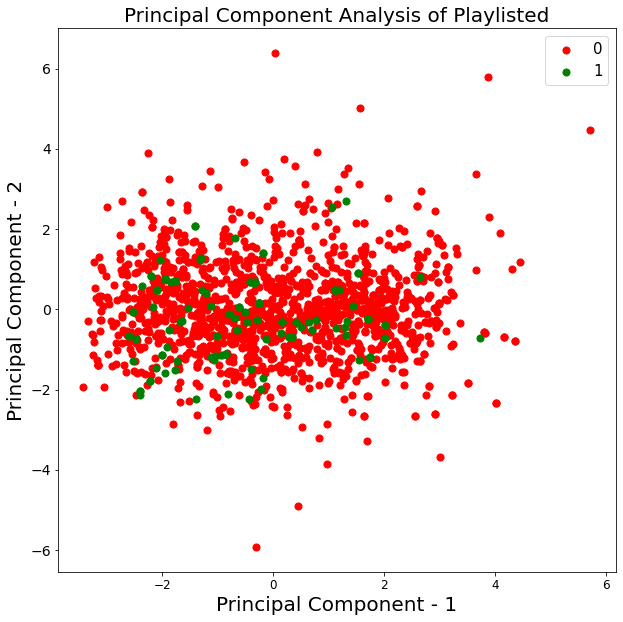
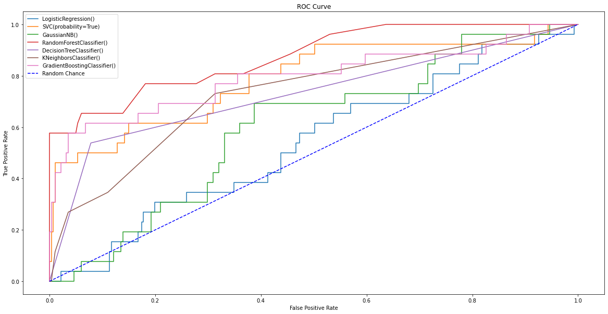
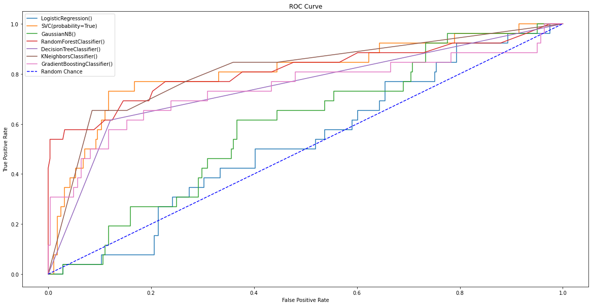

## Objective

Objective is to identify the most important aspects of a song that affect whether or not is playlisted, as well as to predict whether or not a song will be playlisted based on those aspects. Every artist on Spotify knows the importance of being added to a Spotify editorial playlist. As an artist myself, I could wake up to the notification that a song of mine had been added to a playlist and watch my song gain thousands of streams a day. One of the best playlists to be added to in the indie genre is 'undercurrents.'

## Creating the Data

Using spotipy, I pulled the tracks and artist names from 'undercurrents,' and created a dataset of every artist's discography with an indicator variable = 1 if the song is on 'undercurrents' and 0 otherwise. I then wrote a function that added features of every track to the dataset. Up next, I scaled the features and dropped any songs that did not have features available. The resulting dataset 1535 songs by 64 unique artists with 10 song features.


```python
import spotipy
from spotipy.oauth2 import SpotifyClientCredentials
import pandas as pd
import numpy as np

auth_manager = SpotifyClientCredentials()
sp = spotipy.Spotify(auth_manager=auth_manager)

# returns dataframe of all playlist tracks, track ids, artists, and artist ids given a playlist uri

def playlist_df(playlist):
    
    results = sp.playlist_tracks(playlist, fields = 'items')
    
    A = []
    B = []
    C = []
    D = []
      
    for i in range(len(results['items'])):
        A.append(results['items'][i]['track']['name'])
        B.append(results['items'][i]['track']['id'])
        C.append(results['items'][i]['track']['artists'][0]['name'])
        D.append(results['items'][i]['track']['artists'][0]['id'])
        
    dict = {'Track': A, 'Track ID': B, 'Artist': C, 'Artist ID': D}  
    
    df = pd.DataFrame(dict)
        
    return df

# returns lists of artist's discography in tracks and ids given artist id
    
def artist_albums(artist_id):
    
    track_ids = []
    albums = []
    tracks = []
    results = sp.artist_albums(artist_id, album_type='album')
    albums.extend(results['items'])
    
    
    while results['next']:
        results = sp.next(results)
        albums.extend(results['items'])
    
    unique = set()  # skip duplicate albums
    
    for album in albums:
        name = album['name'].lower()
        if name not in unique:
            unique.add(name)
            this_tracks, this_id = show_album_tracks(album)
            tracks += this_tracks
            track_ids += this_id
            
    this_tracks, this_id = top_tracks(artist_id)
    
    tracks += this_tracks
    track_ids += this_id
            
    tracks, ids = unique_tracks(tracks, track_ids)
    
    return tracks, ids

# given lists of tracks and ids, returns lists of only unique tracks and ids

def unique_tracks(ls_t, ls_i):
    unique_t = []
    unique_i = []
    for i in range(0,len(ls_t)):
        if ls_t[i] not in unique_t:
            unique_t.append(ls_t[i])
            unique_i.append(ls_i[i])
    return unique_t, unique_i

# given album, returns list of all tracks and track ids from that album

def show_album_tracks(album):
    ids = []
    tracks = []
    track_names = []
    results = sp.album_tracks(album['id'])
    tracks.extend(results['items'])
    
    while results['next']:
        results = sp.next(results)
        tracks.extend(results['items'])
        
    for track in tracks:
        track_names.append(track['name'])
        ids.append(track['id'])
   
    return track_names, ids

# function that returns top tracks of artist

def top_tracks(artist_id):
    t = []
    d = []
    tracks = sp.artist_top_tracks(artist_id)
    for i in range(len(tracks['tracks'])):
        t.append(tracks['tracks'][i]['album']['name'])
        d.append(tracks['tracks'][i]['album']['id'])
    return t, d

# function that adds songs to df given current df's artist IDs

def add_songs(df):
    old_df = df 
    
    for i in range(0, len(df['Artist ID'])):
        
        artist = df['Artist'][i]
        artist_id = df['Artist ID'][i]
        
        tracks, ids = artist_albums(artist_id)
        
        for j in range(0, len(tracks)):
            new_df = pd.DataFrame([tracks[j], ids[j], artist, artist_id])
            new_df = new_df.transpose()
            new_df = new_df.rename(columns = {0: 'Track', 1: 'Track ID', 2: 'Artist', 3: 'Artist ID'}, index = {0: len(df['Artist ID'])+ i + 1})
            
            df = df.append(new_df)
        
    df2 = df.sort_values(by = ['Artist'])
    df2 = df2.reset_index(drop = True)


    df2['Playlisted'] = df2['Track'].isin(old_df['Track']).astype(int)
    
    return df2

def features(df):
    
    danceability = []
    energy = []
    key = []
    loudness = []
    mode = []
    speechiness = []
    acousticness = []
    instrumentalness = []
    liveness = []
    valence = []
    tempo = []
    dur = []
    sig = []
    ls = [danceability, energy, key, loudness, mode, speechiness,acousticness, instrumentalness, liveness, valence,
         tempo, dur, sig]
    quotes = ['danceability', 'energy', 'key', 'loudness', 'mode', 'speechiness','acousticness', 'instrumentalness', 'liveness', 'valence',
         'tempo', 'duration_ms', 'time_signature']
    
    for id_ in df['Track ID']:
        features = sp.audio_features(id_)
        if features == [None]:
            for item in ls:
                item.append(np.nan)
        else:
            features = features[0]
            for i,j in zip(ls,quotes):
                i.append(features[j])
                
    dic = {'Danceability': danceability, 'Energy': energy, 'Key': key, 'Loudness': loudness, 'Mode': mode,
            'Speechiness': speechiness, 'Acoustic': acousticness, 'Instrumental': instrumentalness,
           'Liveness': liveness, 'Valence': valence, 'Tempo': tempo, 'Dur': dur, 'Sig': sig}
    
    return dic

from sklearn.preprocessing import StandardScaler

def clean(df):
    df = df.dropna()
    df = df.reset_index(drop = True)
    addback = [df['Playlisted'], df['Artist ID'], df['Artist'], df['Track ID'], df['Track'],]
    to_scale = df.drop(columns = ['Playlisted','Track', 'Track ID', 'Artist','Artist ID'])
    scaler = StandardScaler()
    data_scaled = pd.DataFrame(scaler.fit_transform(to_scale), columns = to_scale.columns)
    
    for column in addback:
        data_scaled = pd.concat([pd.DataFrame(column), data_scaled], axis = 1)
 
    return data_scaled
    
```


```python
def main():
    playlist_id = 'spotify:playlist:37i9dQZF1DX9myttyycIxA'
    df = playlist_df(playlist_id)
    df = add_songs(df)
    feats = pd.DataFrame(features(df))
    df = pd.concat([feats, df], axis = 1)
    df = clean(df)
    df.to_csv(r'/Users/harlanhutton/Documents/spotify/undercurrentsdata.csv', index = False)
```


```python
main()
```


```python
data = pd.read_csv('/Users/harlanhutton/Documents/spotify/undercurrentsdata.csv')
data = data.drop(columns = ['Track', 'Track ID', 'Artist', 'Artist ID'])
data.describe()
```


<div>
<style scoped>
    .dataframe tbody tr th:only-of-type {
        vertical-align: middle;
    }

    .dataframe tbody tr th {
        vertical-align: top;
    }

    .dataframe thead th {
        text-align: right;
    }
</style>
<table border="1" class="dataframe">
  <thead>
    <tr style="text-align: right;">
      <th></th>
      <th>Playlisted</th>
      <th>Danceability</th>
      <th>Energy</th>
      <th>Key</th>
      <th>Loudness</th>
      <th>Mode</th>
      <th>Speechiness</th>
      <th>Acoustic</th>
      <th>Instrumental</th>
      <th>Liveness</th>
      <th>Valence</th>
      <th>Tempo</th>
      <th>Dur</th>
      <th>Sig</th>
    </tr>
  </thead>
  <tbody>
    <tr>
      <th>count</th>
      <td>1535.000000</td>
      <td>1.535000e+03</td>
      <td>1.535000e+03</td>
      <td>1.535000e+03</td>
      <td>1.535000e+03</td>
      <td>1.535000e+03</td>
      <td>1.535000e+03</td>
      <td>1.535000e+03</td>
      <td>1.535000e+03</td>
      <td>1.535000e+03</td>
      <td>1.535000e+03</td>
      <td>1.535000e+03</td>
      <td>1.535000e+03</td>
      <td>1.535000e+03</td>
    </tr>
    <tr>
      <th>mean</th>
      <td>0.081433</td>
      <td>5.667562e-16</td>
      <td>-2.392223e-16</td>
      <td>-9.402540e-18</td>
      <td>2.464324e-16</td>
      <td>4.044539e-16</td>
      <td>-1.399894e-16</td>
      <td>5.019510e-17</td>
      <td>-1.338054e-17</td>
      <td>-2.179400e-16</td>
      <td>1.780696e-16</td>
      <td>3.694023e-16</td>
      <td>-5.804260e-17</td>
      <td>4.082149e-16</td>
    </tr>
    <tr>
      <th>std</th>
      <td>0.273588</td>
      <td>1.000326e+00</td>
      <td>1.000326e+00</td>
      <td>1.000326e+00</td>
      <td>1.000326e+00</td>
      <td>1.000326e+00</td>
      <td>1.000326e+00</td>
      <td>1.000326e+00</td>
      <td>1.000326e+00</td>
      <td>1.000326e+00</td>
      <td>1.000326e+00</td>
      <td>1.000326e+00</td>
      <td>1.000326e+00</td>
      <td>1.000326e+00</td>
    </tr>
    <tr>
      <th>min</th>
      <td>0.000000</td>
      <td>-3.473069e+00</td>
      <td>-2.019390e+00</td>
      <td>-1.503179e+00</td>
      <td>-5.504848e+00</td>
      <td>-1.846867e+00</td>
      <td>-9.326163e-01</td>
      <td>-1.352153e+00</td>
      <td>-6.495128e-01</td>
      <td>-1.132672e+00</td>
      <td>-1.747442e+00</td>
      <td>-4.237749e+00</td>
      <td>-2.034555e+00</td>
      <td>-7.160654e+00</td>
    </tr>
    <tr>
      <th>25%</th>
      <td>0.000000</td>
      <td>-6.854757e-01</td>
      <td>-7.810510e-01</td>
      <td>-9.376447e-01</td>
      <td>-5.547581e-01</td>
      <td>5.414574e-01</td>
      <td>-2.988738e-01</td>
      <td>-1.026224e+00</td>
      <td>-6.491983e-01</td>
      <td>-5.676936e-01</td>
      <td>-8.253855e-01</td>
      <td>-7.041348e-01</td>
      <td>-5.060949e-01</td>
      <td>2.849710e-01</td>
    </tr>
    <tr>
      <th>50%</th>
      <td>0.000000</td>
      <td>4.773749e-02</td>
      <td>-3.753491e-02</td>
      <td>-8.934336e-02</td>
      <td>1.640824e-01</td>
      <td>5.414574e-01</td>
      <td>-1.983638e-01</td>
      <td>3.060128e-02</td>
      <td>-6.163751e-01</td>
      <td>-4.175594e-01</td>
      <td>-1.143471e-01</td>
      <td>-1.108247e-03</td>
      <td>-1.120568e-01</td>
      <td>2.849710e-01</td>
    </tr>
    <tr>
      <th>75%</th>
      <td>0.000000</td>
      <td>7.394481e-01</td>
      <td>7.786235e-01</td>
      <td>1.041725e+00</td>
      <td>7.160686e-01</td>
      <td>5.414574e-01</td>
      <td>-2.379364e-02</td>
      <td>1.038042e+00</td>
      <td>3.998468e-01</td>
      <td>2.224864e-01</td>
      <td>6.494458e-01</td>
      <td>6.289989e-01</td>
      <td>3.403805e-01</td>
      <td>2.849710e-01</td>
    </tr>
    <tr>
      <th>max</th>
      <td>1.000000</td>
      <td>2.946005e+00</td>
      <td>2.163102e+00</td>
      <td>1.607259e+00</td>
      <td>1.944909e+00</td>
      <td>5.414574e-01</td>
      <td>1.770936e+01</td>
      <td>1.455693e+00</td>
      <td>2.493832e+00</td>
      <td>5.824863e+00</td>
      <td>2.752743e+00</td>
      <td>3.087657e+00</td>
      <td>1.306110e+01</td>
      <td>2.146377e+00</td>
    </tr>
  </tbody>
</table>
</div>


## Variable Importance


```python
corr = data.corr()
corr.style.background_gradient(cmap='coolwarm')
```


<style  type="text/css" >
    #T_52fa3e44_22d0_11eb_804b_acde48001122row0_col0 {
            background-color:  #b40426;
            color:  #f1f1f1;
        }    #T_52fa3e44_22d0_11eb_804b_acde48001122row0_col1 {
            background-color:  #7b9ff9;
            color:  #000000;
        }    #T_52fa3e44_22d0_11eb_804b_acde48001122row0_col2 {
            background-color:  #cedaeb;
            color:  #000000;
        }    #T_52fa3e44_22d0_11eb_804b_acde48001122row0_col3 {
            background-color:  #6788ee;
            color:  #000000;
        }    #T_52fa3e44_22d0_11eb_804b_acde48001122row0_col4 {
            background-color:  #cbd8ee;
            color:  #000000;
        }    #T_52fa3e44_22d0_11eb_804b_acde48001122row0_col5 {
            background-color:  #7396f5;
            color:  #000000;
        }    #T_52fa3e44_22d0_11eb_804b_acde48001122row0_col6 {
            background-color:  #455cce;
            color:  #f1f1f1;
        }    #T_52fa3e44_22d0_11eb_804b_acde48001122row0_col7 {
            background-color:  #b6cefa;
            color:  #000000;
        }    #T_52fa3e44_22d0_11eb_804b_acde48001122row0_col8 {
            background-color:  #536edd;
            color:  #000000;
        }    #T_52fa3e44_22d0_11eb_804b_acde48001122row0_col9 {
            background-color:  #5b7ae5;
            color:  #000000;
        }    #T_52fa3e44_22d0_11eb_804b_acde48001122row0_col10 {
            background-color:  #a1c0ff;
            color:  #000000;
        }    #T_52fa3e44_22d0_11eb_804b_acde48001122row0_col11 {
            background-color:  #6f92f3;
            color:  #000000;
        }    #T_52fa3e44_22d0_11eb_804b_acde48001122row0_col12 {
            background-color:  #5b7ae5;
            color:  #000000;
        }    #T_52fa3e44_22d0_11eb_804b_acde48001122row0_col13 {
            background-color:  #688aef;
            color:  #000000;
        }    #T_52fa3e44_22d0_11eb_804b_acde48001122row1_col0 {
            background-color:  #6b8df0;
            color:  #000000;
        }    #T_52fa3e44_22d0_11eb_804b_acde48001122row1_col1 {
            background-color:  #b40426;
            color:  #f1f1f1;
        }    #T_52fa3e44_22d0_11eb_804b_acde48001122row1_col2 {
            background-color:  #c4d5f3;
            color:  #000000;
        }    #T_52fa3e44_22d0_11eb_804b_acde48001122row1_col3 {
            background-color:  #7396f5;
            color:  #000000;
        }    #T_52fa3e44_22d0_11eb_804b_acde48001122row1_col4 {
            background-color:  #bfd3f6;
            color:  #000000;
        }    #T_52fa3e44_22d0_11eb_804b_acde48001122row1_col5 {
            background-color:  #6485ec;
            color:  #000000;
        }    #T_52fa3e44_22d0_11eb_804b_acde48001122row1_col6 {
            background-color:  #5a78e4;
            color:  #000000;
        }    #T_52fa3e44_22d0_11eb_804b_acde48001122row1_col7 {
            background-color:  #c3d5f4;
            color:  #000000;
        }    #T_52fa3e44_22d0_11eb_804b_acde48001122row1_col8 {
            background-color:  #3b4cc0;
            color:  #f1f1f1;
        }    #T_52fa3e44_22d0_11eb_804b_acde48001122row1_col9 {
            background-color:  #465ecf;
            color:  #f1f1f1;
        }    #T_52fa3e44_22d0_11eb_804b_acde48001122row1_col10 {
            background-color:  #e5d8d1;
            color:  #000000;
        }    #T_52fa3e44_22d0_11eb_804b_acde48001122row1_col11 {
            background-color:  #4e68d8;
            color:  #000000;
        }    #T_52fa3e44_22d0_11eb_804b_acde48001122row1_col12 {
            background-color:  #3b4cc0;
            color:  #f1f1f1;
        }    #T_52fa3e44_22d0_11eb_804b_acde48001122row1_col13 {
            background-color:  #6180e9;
            color:  #000000;
        }    #T_52fa3e44_22d0_11eb_804b_acde48001122row2_col0 {
            background-color:  #6282ea;
            color:  #000000;
        }    #T_52fa3e44_22d0_11eb_804b_acde48001122row2_col1 {
            background-color:  #5f7fe8;
            color:  #000000;
        }    #T_52fa3e44_22d0_11eb_804b_acde48001122row2_col2 {
            background-color:  #b40426;
            color:  #f1f1f1;
        }    #T_52fa3e44_22d0_11eb_804b_acde48001122row2_col3 {
            background-color:  #7093f3;
            color:  #000000;
        }    #T_52fa3e44_22d0_11eb_804b_acde48001122row2_col4 {
            background-color:  #dd5f4b;
            color:  #000000;
        }    #T_52fa3e44_22d0_11eb_804b_acde48001122row2_col5 {
            background-color:  #5a78e4;
            color:  #000000;
        }    #T_52fa3e44_22d0_11eb_804b_acde48001122row2_col6 {
            background-color:  #6180e9;
            color:  #000000;
        }    #T_52fa3e44_22d0_11eb_804b_acde48001122row2_col7 {
            background-color:  #3b4cc0;
            color:  #f1f1f1;
        }    #T_52fa3e44_22d0_11eb_804b_acde48001122row2_col8 {
            background-color:  #81a4fb;
            color:  #000000;
        }    #T_52fa3e44_22d0_11eb_804b_acde48001122row2_col9 {
            background-color:  #98b9ff;
            color:  #000000;
        }    #T_52fa3e44_22d0_11eb_804b_acde48001122row2_col10 {
            background-color:  #f5c2aa;
            color:  #000000;
        }    #T_52fa3e44_22d0_11eb_804b_acde48001122row2_col11 {
            background-color:  #a3c2fe;
            color:  #000000;
        }    #T_52fa3e44_22d0_11eb_804b_acde48001122row2_col12 {
            background-color:  #7295f4;
            color:  #000000;
        }    #T_52fa3e44_22d0_11eb_804b_acde48001122row2_col13 {
            background-color:  #80a3fa;
            color:  #000000;
        }    #T_52fa3e44_22d0_11eb_804b_acde48001122row3_col0 {
            background-color:  #4b64d5;
            color:  #f1f1f1;
        }    #T_52fa3e44_22d0_11eb_804b_acde48001122row3_col1 {
            background-color:  #688aef;
            color:  #000000;
        }    #T_52fa3e44_22d0_11eb_804b_acde48001122row3_col2 {
            background-color:  #c7d7f0;
            color:  #000000;
        }    #T_52fa3e44_22d0_11eb_804b_acde48001122row3_col3 {
            background-color:  #b40426;
            color:  #f1f1f1;
        }    #T_52fa3e44_22d0_11eb_804b_acde48001122row3_col4 {
            background-color:  #bcd2f7;
            color:  #000000;
        }    #T_52fa3e44_22d0_11eb_804b_acde48001122row3_col5 {
            background-color:  #3b4cc0;
            color:  #f1f1f1;
        }    #T_52fa3e44_22d0_11eb_804b_acde48001122row3_col6 {
            background-color:  #5f7fe8;
            color:  #000000;
        }    #T_52fa3e44_22d0_11eb_804b_acde48001122row3_col7 {
            background-color:  #c7d7f0;
            color:  #000000;
        }    #T_52fa3e44_22d0_11eb_804b_acde48001122row3_col8 {
            background-color:  #5f7fe8;
            color:  #000000;
        }    #T_52fa3e44_22d0_11eb_804b_acde48001122row3_col9 {
            background-color:  #688aef;
            color:  #000000;
        }    #T_52fa3e44_22d0_11eb_804b_acde48001122row3_col10 {
            background-color:  #9abbff;
            color:  #000000;
        }    #T_52fa3e44_22d0_11eb_804b_acde48001122row3_col11 {
            background-color:  #5f7fe8;
            color:  #000000;
        }    #T_52fa3e44_22d0_11eb_804b_acde48001122row3_col12 {
            background-color:  #6384eb;
            color:  #000000;
        }    #T_52fa3e44_22d0_11eb_804b_acde48001122row3_col13 {
            background-color:  #6a8bef;
            color:  #000000;
        }    #T_52fa3e44_22d0_11eb_804b_acde48001122row4_col0 {
            background-color:  #6788ee;
            color:  #000000;
        }    #T_52fa3e44_22d0_11eb_804b_acde48001122row4_col1 {
            background-color:  #6687ed;
            color:  #000000;
        }    #T_52fa3e44_22d0_11eb_804b_acde48001122row4_col2 {
            background-color:  #da5a49;
            color:  #000000;
        }    #T_52fa3e44_22d0_11eb_804b_acde48001122row4_col3 {
            background-color:  #6b8df0;
            color:  #000000;
        }    #T_52fa3e44_22d0_11eb_804b_acde48001122row4_col4 {
            background-color:  #b40426;
            color:  #f1f1f1;
        }    #T_52fa3e44_22d0_11eb_804b_acde48001122row4_col5 {
            background-color:  #6180e9;
            color:  #000000;
        }    #T_52fa3e44_22d0_11eb_804b_acde48001122row4_col6 {
            background-color:  #4257c9;
            color:  #f1f1f1;
        }    #T_52fa3e44_22d0_11eb_804b_acde48001122row4_col7 {
            background-color:  #465ecf;
            color:  #f1f1f1;
        }    #T_52fa3e44_22d0_11eb_804b_acde48001122row4_col8 {
            background-color:  #5572df;
            color:  #000000;
        }    #T_52fa3e44_22d0_11eb_804b_acde48001122row4_col9 {
            background-color:  #80a3fa;
            color:  #000000;
        }    #T_52fa3e44_22d0_11eb_804b_acde48001122row4_col10 {
            background-color:  #e3d9d3;
            color:  #000000;
        }    #T_52fa3e44_22d0_11eb_804b_acde48001122row4_col11 {
            background-color:  #89acfd;
            color:  #000000;
        }    #T_52fa3e44_22d0_11eb_804b_acde48001122row4_col12 {
            background-color:  #6687ed;
            color:  #000000;
        }    #T_52fa3e44_22d0_11eb_804b_acde48001122row4_col13 {
            background-color:  #7da0f9;
            color:  #000000;
        }    #T_52fa3e44_22d0_11eb_804b_acde48001122row5_col0 {
            background-color:  #5875e1;
            color:  #000000;
        }    #T_52fa3e44_22d0_11eb_804b_acde48001122row5_col1 {
            background-color:  #5a78e4;
            color:  #000000;
        }    #T_52fa3e44_22d0_11eb_804b_acde48001122row5_col2 {
            background-color:  #b9d0f9;
            color:  #000000;
        }    #T_52fa3e44_22d0_11eb_804b_acde48001122row5_col3 {
            background-color:  #3b4cc0;
            color:  #f1f1f1;
        }    #T_52fa3e44_22d0_11eb_804b_acde48001122row5_col4 {
            background-color:  #b3cdfb;
            color:  #000000;
        }    #T_52fa3e44_22d0_11eb_804b_acde48001122row5_col5 {
            background-color:  #b40426;
            color:  #f1f1f1;
        }    #T_52fa3e44_22d0_11eb_804b_acde48001122row5_col6 {
            background-color:  #3f53c6;
            color:  #f1f1f1;
        }    #T_52fa3e44_22d0_11eb_804b_acde48001122row5_col7 {
            background-color:  #cbd8ee;
            color:  #000000;
        }    #T_52fa3e44_22d0_11eb_804b_acde48001122row5_col8 {
            background-color:  #5a78e4;
            color:  #000000;
        }    #T_52fa3e44_22d0_11eb_804b_acde48001122row5_col9 {
            background-color:  #506bda;
            color:  #000000;
        }    #T_52fa3e44_22d0_11eb_804b_acde48001122row5_col10 {
            background-color:  #8badfd;
            color:  #000000;
        }    #T_52fa3e44_22d0_11eb_804b_acde48001122row5_col11 {
            background-color:  #7295f4;
            color:  #000000;
        }    #T_52fa3e44_22d0_11eb_804b_acde48001122row5_col12 {
            background-color:  #5f7fe8;
            color:  #000000;
        }    #T_52fa3e44_22d0_11eb_804b_acde48001122row5_col13 {
            background-color:  #5572df;
            color:  #000000;
        }    #T_52fa3e44_22d0_11eb_804b_acde48001122row6_col0 {
            background-color:  #455cce;
            color:  #f1f1f1;
        }    #T_52fa3e44_22d0_11eb_804b_acde48001122row6_col1 {
            background-color:  #6b8df0;
            color:  #000000;
        }    #T_52fa3e44_22d0_11eb_804b_acde48001122row6_col2 {
            background-color:  #cedaeb;
            color:  #000000;
        }    #T_52fa3e44_22d0_11eb_804b_acde48001122row6_col3 {
            background-color:  #7b9ff9;
            color:  #000000;
        }    #T_52fa3e44_22d0_11eb_804b_acde48001122row6_col4 {
            background-color:  #b2ccfb;
            color:  #000000;
        }    #T_52fa3e44_22d0_11eb_804b_acde48001122row6_col5 {
            background-color:  #5b7ae5;
            color:  #000000;
        }    #T_52fa3e44_22d0_11eb_804b_acde48001122row6_col6 {
            background-color:  #b40426;
            color:  #f1f1f1;
        }    #T_52fa3e44_22d0_11eb_804b_acde48001122row6_col7 {
            background-color:  #cedaeb;
            color:  #000000;
        }    #T_52fa3e44_22d0_11eb_804b_acde48001122row6_col8 {
            background-color:  #6384eb;
            color:  #000000;
        }    #T_52fa3e44_22d0_11eb_804b_acde48001122row6_col9 {
            background-color:  #80a3fa;
            color:  #000000;
        }    #T_52fa3e44_22d0_11eb_804b_acde48001122row6_col10 {
            background-color:  #9bbcff;
            color:  #000000;
        }    #T_52fa3e44_22d0_11eb_804b_acde48001122row6_col11 {
            background-color:  #7597f6;
            color:  #000000;
        }    #T_52fa3e44_22d0_11eb_804b_acde48001122row6_col12 {
            background-color:  #4a63d3;
            color:  #f1f1f1;
        }    #T_52fa3e44_22d0_11eb_804b_acde48001122row6_col13 {
            background-color:  #5875e1;
            color:  #000000;
        }    #T_52fa3e44_22d0_11eb_804b_acde48001122row7_col0 {
            background-color:  #3b4cc0;
            color:  #f1f1f1;
        }    #T_52fa3e44_22d0_11eb_804b_acde48001122row7_col1 {
            background-color:  #5e7de7;
            color:  #000000;
        }    #T_52fa3e44_22d0_11eb_804b_acde48001122row7_col2 {
            background-color:  #3b4cc0;
            color:  #f1f1f1;
        }    #T_52fa3e44_22d0_11eb_804b_acde48001122row7_col3 {
            background-color:  #7295f4;
            color:  #000000;
        }    #T_52fa3e44_22d0_11eb_804b_acde48001122row7_col4 {
            background-color:  #3b4cc0;
            color:  #f1f1f1;
        }    #T_52fa3e44_22d0_11eb_804b_acde48001122row7_col5 {
            background-color:  #779af7;
            color:  #000000;
        }    #T_52fa3e44_22d0_11eb_804b_acde48001122row7_col6 {
            background-color:  #6180e9;
            color:  #000000;
        }    #T_52fa3e44_22d0_11eb_804b_acde48001122row7_col7 {
            background-color:  #b40426;
            color:  #f1f1f1;
        }    #T_52fa3e44_22d0_11eb_804b_acde48001122row7_col8 {
            background-color:  #7699f6;
            color:  #000000;
        }    #T_52fa3e44_22d0_11eb_804b_acde48001122row7_col9 {
            background-color:  #3b4cc0;
            color:  #f1f1f1;
        }    #T_52fa3e44_22d0_11eb_804b_acde48001122row7_col10 {
            background-color:  #3b4cc0;
            color:  #f1f1f1;
        }    #T_52fa3e44_22d0_11eb_804b_acde48001122row7_col11 {
            background-color:  #3b4cc0;
            color:  #f1f1f1;
        }    #T_52fa3e44_22d0_11eb_804b_acde48001122row7_col12 {
            background-color:  #536edd;
            color:  #000000;
        }    #T_52fa3e44_22d0_11eb_804b_acde48001122row7_col13 {
            background-color:  #3b4cc0;
            color:  #f1f1f1;
        }    #T_52fa3e44_22d0_11eb_804b_acde48001122row8_col0 {
            background-color:  #4257c9;
            color:  #f1f1f1;
        }    #T_52fa3e44_22d0_11eb_804b_acde48001122row8_col1 {
            background-color:  #3b4cc0;
            color:  #f1f1f1;
        }    #T_52fa3e44_22d0_11eb_804b_acde48001122row8_col2 {
            background-color:  #d6dce4;
            color:  #000000;
        }    #T_52fa3e44_22d0_11eb_804b_acde48001122row8_col3 {
            background-color:  #6a8bef;
            color:  #000000;
        }    #T_52fa3e44_22d0_11eb_804b_acde48001122row8_col4 {
            background-color:  #b3cdfb;
            color:  #000000;
        }    #T_52fa3e44_22d0_11eb_804b_acde48001122row8_col5 {
            background-color:  #6687ed;
            color:  #000000;
        }    #T_52fa3e44_22d0_11eb_804b_acde48001122row8_col6 {
            background-color:  #536edd;
            color:  #000000;
        }    #T_52fa3e44_22d0_11eb_804b_acde48001122row8_col7 {
            background-color:  #d1dae9;
            color:  #000000;
        }    #T_52fa3e44_22d0_11eb_804b_acde48001122row8_col8 {
            background-color:  #b40426;
            color:  #f1f1f1;
        }    #T_52fa3e44_22d0_11eb_804b_acde48001122row8_col9 {
            background-color:  #5875e1;
            color:  #000000;
        }    #T_52fa3e44_22d0_11eb_804b_acde48001122row8_col10 {
            background-color:  #86a9fc;
            color:  #000000;
        }    #T_52fa3e44_22d0_11eb_804b_acde48001122row8_col11 {
            background-color:  #5f7fe8;
            color:  #000000;
        }    #T_52fa3e44_22d0_11eb_804b_acde48001122row8_col12 {
            background-color:  #6788ee;
            color:  #000000;
        }    #T_52fa3e44_22d0_11eb_804b_acde48001122row8_col13 {
            background-color:  #506bda;
            color:  #000000;
        }    #T_52fa3e44_22d0_11eb_804b_acde48001122row9_col0 {
            background-color:  #516ddb;
            color:  #000000;
        }    #T_52fa3e44_22d0_11eb_804b_acde48001122row9_col1 {
            background-color:  #4e68d8;
            color:  #000000;
        }    #T_52fa3e44_22d0_11eb_804b_acde48001122row9_col2 {
            background-color:  #e4d9d2;
            color:  #000000;
        }    #T_52fa3e44_22d0_11eb_804b_acde48001122row9_col3 {
            background-color:  #7a9df8;
            color:  #000000;
        }    #T_52fa3e44_22d0_11eb_804b_acde48001122row9_col4 {
            background-color:  #d3dbe7;
            color:  #000000;
        }    #T_52fa3e44_22d0_11eb_804b_acde48001122row9_col5 {
            background-color:  #6282ea;
            color:  #000000;
        }    #T_52fa3e44_22d0_11eb_804b_acde48001122row9_col6 {
            background-color:  #7699f6;
            color:  #000000;
        }    #T_52fa3e44_22d0_11eb_804b_acde48001122row9_col7 {
            background-color:  #aec9fc;
            color:  #000000;
        }    #T_52fa3e44_22d0_11eb_804b_acde48001122row9_col8 {
            background-color:  #5e7de7;
            color:  #000000;
        }    #T_52fa3e44_22d0_11eb_804b_acde48001122row9_col9 {
            background-color:  #b40426;
            color:  #f1f1f1;
        }    #T_52fa3e44_22d0_11eb_804b_acde48001122row9_col10 {
            background-color:  #abc8fd;
            color:  #000000;
        }    #T_52fa3e44_22d0_11eb_804b_acde48001122row9_col11 {
            background-color:  #6788ee;
            color:  #000000;
        }    #T_52fa3e44_22d0_11eb_804b_acde48001122row9_col12 {
            background-color:  #5875e1;
            color:  #000000;
        }    #T_52fa3e44_22d0_11eb_804b_acde48001122row9_col13 {
            background-color:  #5572df;
            color:  #000000;
        }    #T_52fa3e44_22d0_11eb_804b_acde48001122row10_col0 {
            background-color:  #6282ea;
            color:  #000000;
        }    #T_52fa3e44_22d0_11eb_804b_acde48001122row10_col1 {
            background-color:  #cdd9ec;
            color:  #000000;
        }    #T_52fa3e44_22d0_11eb_804b_acde48001122row10_col2 {
            background-color:  #f7aa8c;
            color:  #000000;
        }    #T_52fa3e44_22d0_11eb_804b_acde48001122row10_col3 {
            background-color:  #7396f5;
            color:  #000000;
        }    #T_52fa3e44_22d0_11eb_804b_acde48001122row10_col4 {
            background-color:  #f2cab5;
            color:  #000000;
        }    #T_52fa3e44_22d0_11eb_804b_acde48001122row10_col5 {
            background-color:  #6384eb;
            color:  #000000;
        }    #T_52fa3e44_22d0_11eb_804b_acde48001122row10_col6 {
            background-color:  #5b7ae5;
            color:  #000000;
        }    #T_52fa3e44_22d0_11eb_804b_acde48001122row10_col7 {
            background-color:  #7b9ff9;
            color:  #000000;
        }    #T_52fa3e44_22d0_11eb_804b_acde48001122row10_col8 {
            background-color:  #5470de;
            color:  #000000;
        }    #T_52fa3e44_22d0_11eb_804b_acde48001122row10_col9 {
            background-color:  #799cf8;
            color:  #000000;
        }    #T_52fa3e44_22d0_11eb_804b_acde48001122row10_col10 {
            background-color:  #b40426;
            color:  #f1f1f1;
        }    #T_52fa3e44_22d0_11eb_804b_acde48001122row10_col11 {
            background-color:  #89acfd;
            color:  #000000;
        }    #T_52fa3e44_22d0_11eb_804b_acde48001122row10_col12 {
            background-color:  #3b4cc0;
            color:  #f1f1f1;
        }    #T_52fa3e44_22d0_11eb_804b_acde48001122row10_col13 {
            background-color:  #7396f5;
            color:  #000000;
        }    #T_52fa3e44_22d0_11eb_804b_acde48001122row11_col0 {
            background-color:  #5f7fe8;
            color:  #000000;
        }    #T_52fa3e44_22d0_11eb_804b_acde48001122row11_col1 {
            background-color:  #4e68d8;
            color:  #000000;
        }    #T_52fa3e44_22d0_11eb_804b_acde48001122row11_col2 {
            background-color:  #e7d7ce;
            color:  #000000;
        }    #T_52fa3e44_22d0_11eb_804b_acde48001122row11_col3 {
            background-color:  #6b8df0;
            color:  #000000;
        }    #T_52fa3e44_22d0_11eb_804b_acde48001122row11_col4 {
            background-color:  #d5dbe5;
            color:  #000000;
        }    #T_52fa3e44_22d0_11eb_804b_acde48001122row11_col5 {
            background-color:  #7da0f9;
            color:  #000000;
        }    #T_52fa3e44_22d0_11eb_804b_acde48001122row11_col6 {
            background-color:  #6384eb;
            color:  #000000;
        }    #T_52fa3e44_22d0_11eb_804b_acde48001122row11_col7 {
            background-color:  #a9c6fd;
            color:  #000000;
        }    #T_52fa3e44_22d0_11eb_804b_acde48001122row11_col8 {
            background-color:  #5f7fe8;
            color:  #000000;
        }    #T_52fa3e44_22d0_11eb_804b_acde48001122row11_col9 {
            background-color:  #6180e9;
            color:  #000000;
        }    #T_52fa3e44_22d0_11eb_804b_acde48001122row11_col10 {
            background-color:  #b3cdfb;
            color:  #000000;
        }    #T_52fa3e44_22d0_11eb_804b_acde48001122row11_col11 {
            background-color:  #b40426;
            color:  #f1f1f1;
        }    #T_52fa3e44_22d0_11eb_804b_acde48001122row11_col12 {
            background-color:  #5d7ce6;
            color:  #000000;
        }    #T_52fa3e44_22d0_11eb_804b_acde48001122row11_col13 {
            background-color:  #5875e1;
            color:  #000000;
        }    #T_52fa3e44_22d0_11eb_804b_acde48001122row12_col0 {
            background-color:  #4b64d5;
            color:  #f1f1f1;
        }    #T_52fa3e44_22d0_11eb_804b_acde48001122row12_col1 {
            background-color:  #3c4ec2;
            color:  #f1f1f1;
        }    #T_52fa3e44_22d0_11eb_804b_acde48001122row12_col2 {
            background-color:  #cedaeb;
            color:  #000000;
        }    #T_52fa3e44_22d0_11eb_804b_acde48001122row12_col3 {
            background-color:  #6f92f3;
            color:  #000000;
        }    #T_52fa3e44_22d0_11eb_804b_acde48001122row12_col4 {
            background-color:  #c0d4f5;
            color:  #000000;
        }    #T_52fa3e44_22d0_11eb_804b_acde48001122row12_col5 {
            background-color:  #6b8df0;
            color:  #000000;
        }    #T_52fa3e44_22d0_11eb_804b_acde48001122row12_col6 {
            background-color:  #3b4cc0;
            color:  #f1f1f1;
        }    #T_52fa3e44_22d0_11eb_804b_acde48001122row12_col7 {
            background-color:  #bcd2f7;
            color:  #000000;
        }    #T_52fa3e44_22d0_11eb_804b_acde48001122row12_col8 {
            background-color:  #6788ee;
            color:  #000000;
        }    #T_52fa3e44_22d0_11eb_804b_acde48001122row12_col9 {
            background-color:  #516ddb;
            color:  #000000;
        }    #T_52fa3e44_22d0_11eb_804b_acde48001122row12_col10 {
            background-color:  #6e90f2;
            color:  #000000;
        }    #T_52fa3e44_22d0_11eb_804b_acde48001122row12_col11 {
            background-color:  #5d7ce6;
            color:  #000000;
        }    #T_52fa3e44_22d0_11eb_804b_acde48001122row12_col12 {
            background-color:  #b40426;
            color:  #f1f1f1;
        }    #T_52fa3e44_22d0_11eb_804b_acde48001122row12_col13 {
            background-color:  #5875e1;
            color:  #000000;
        }    #T_52fa3e44_22d0_11eb_804b_acde48001122row13_col0 {
            background-color:  #6180e9;
            color:  #000000;
        }    #T_52fa3e44_22d0_11eb_804b_acde48001122row13_col1 {
            background-color:  #6a8bef;
            color:  #000000;
        }    #T_52fa3e44_22d0_11eb_804b_acde48001122row13_col2 {
            background-color:  #dadce0;
            color:  #000000;
        }    #T_52fa3e44_22d0_11eb_804b_acde48001122row13_col3 {
            background-color:  #7da0f9;
            color:  #000000;
        }    #T_52fa3e44_22d0_11eb_804b_acde48001122row13_col4 {
            background-color:  #d3dbe7;
            color:  #000000;
        }    #T_52fa3e44_22d0_11eb_804b_acde48001122row13_col5 {
            background-color:  #688aef;
            color:  #000000;
        }    #T_52fa3e44_22d0_11eb_804b_acde48001122row13_col6 {
            background-color:  #4f69d9;
            color:  #000000;
        }    #T_52fa3e44_22d0_11eb_804b_acde48001122row13_col7 {
            background-color:  #afcafc;
            color:  #000000;
        }    #T_52fa3e44_22d0_11eb_804b_acde48001122row13_col8 {
            background-color:  #5977e3;
            color:  #000000;
        }    #T_52fa3e44_22d0_11eb_804b_acde48001122row13_col9 {
            background-color:  #5875e1;
            color:  #000000;
        }    #T_52fa3e44_22d0_11eb_804b_acde48001122row13_col10 {
            background-color:  #a9c6fd;
            color:  #000000;
        }    #T_52fa3e44_22d0_11eb_804b_acde48001122row13_col11 {
            background-color:  #6180e9;
            color:  #000000;
        }    #T_52fa3e44_22d0_11eb_804b_acde48001122row13_col12 {
            background-color:  #5f7fe8;
            color:  #000000;
        }    #T_52fa3e44_22d0_11eb_804b_acde48001122row13_col13 {
            background-color:  #b40426;
            color:  #f1f1f1;
        }</style><table id="T_52fa3e44_22d0_11eb_804b_acde48001122" ><thead>    <tr>        <th class="blank level0" ></th>        <th class="col_heading level0 col0" >Playlisted</th>        <th class="col_heading level0 col1" >Danceability</th>        <th class="col_heading level0 col2" >Energy</th>        <th class="col_heading level0 col3" >Key</th>        <th class="col_heading level0 col4" >Loudness</th>        <th class="col_heading level0 col5" >Mode</th>        <th class="col_heading level0 col6" >Speechiness</th>        <th class="col_heading level0 col7" >Acoustic</th>        <th class="col_heading level0 col8" >Instrumental</th>        <th class="col_heading level0 col9" >Liveness</th>        <th class="col_heading level0 col10" >Valence</th>        <th class="col_heading level0 col11" >Tempo</th>        <th class="col_heading level0 col12" >Dur</th>        <th class="col_heading level0 col13" >Sig</th>    </tr></thead><tbody>
                <tr>
                        <th id="T_52fa3e44_22d0_11eb_804b_acde48001122level0_row0" class="row_heading level0 row0" >Playlisted</th>
                        <td id="T_52fa3e44_22d0_11eb_804b_acde48001122row0_col0" class="data row0 col0" >1.000000</td>
                        <td id="T_52fa3e44_22d0_11eb_804b_acde48001122row0_col1" class="data row0 col1" >0.088769</td>
                        <td id="T_52fa3e44_22d0_11eb_804b_acde48001122row0_col2" class="data row0 col2" >0.059082</td>
                        <td id="T_52fa3e44_22d0_11eb_804b_acde48001122row0_col3" class="data row0 col3" >-0.019193</td>
                        <td id="T_52fa3e44_22d0_11eb_804b_acde48001122row0_col4" class="data row0 col4" >0.076781</td>
                        <td id="T_52fa3e44_22d0_11eb_804b_acde48001122row0_col5" class="data row0 col5" >0.024683</td>
                        <td id="T_52fa3e44_22d0_11eb_804b_acde48001122row0_col6" class="data row0 col6" >-0.038155</td>
                        <td id="T_52fa3e44_22d0_11eb_804b_acde48001122row0_col7" class="data row0 col7" >-0.078854</td>
                        <td id="T_52fa3e44_22d0_11eb_804b_acde48001122row0_col8" class="data row0 col8" >-0.051033</td>
                        <td id="T_52fa3e44_22d0_11eb_804b_acde48001122row0_col9" class="data row0 col9" >0.003201</td>
                        <td id="T_52fa3e44_22d0_11eb_804b_acde48001122row0_col10" class="data row0 col10" >0.056215</td>
                        <td id="T_52fa3e44_22d0_11eb_804b_acde48001122row0_col11" class="data row0 col11" >0.048068</td>
                        <td id="T_52fa3e44_22d0_11eb_804b_acde48001122row0_col12" class="data row0 col12" >-0.016978</td>
                        <td id="T_52fa3e44_22d0_11eb_804b_acde48001122row0_col13" class="data row0 col13" >0.053812</td>
            </tr>
            <tr>
                        <th id="T_52fa3e44_22d0_11eb_804b_acde48001122level0_row1" class="row_heading level0 row1" >Danceability</th>
                        <td id="T_52fa3e44_22d0_11eb_804b_acde48001122row1_col0" class="data row1 col0" >0.088769</td>
                        <td id="T_52fa3e44_22d0_11eb_804b_acde48001122row1_col1" class="data row1 col1" >1.000000</td>
                        <td id="T_52fa3e44_22d0_11eb_804b_acde48001122row1_col2" class="data row1 col2" >-0.005452</td>
                        <td id="T_52fa3e44_22d0_11eb_804b_acde48001122row1_col3" class="data row1 col3" >0.023790</td>
                        <td id="T_52fa3e44_22d0_11eb_804b_acde48001122row1_col4" class="data row1 col4" >0.015748</td>
                        <td id="T_52fa3e44_22d0_11eb_804b_acde48001122row1_col5" class="data row1 col5" >-0.025128</td>
                        <td id="T_52fa3e44_22d0_11eb_804b_acde48001122row1_col6" class="data row1 col6" >0.035625</td>
                        <td id="T_52fa3e44_22d0_11eb_804b_acde48001122row1_col7" class="data row1 col7" >-0.011931</td>
                        <td id="T_52fa3e44_22d0_11eb_804b_acde48001122row1_col8" class="data row1 col8" >-0.142746</td>
                        <td id="T_52fa3e44_22d0_11eb_804b_acde48001122row1_col9" class="data row1 col9" >-0.070459</td>
                        <td id="T_52fa3e44_22d0_11eb_804b_acde48001122row1_col10" class="data row1 col10" >0.363832</td>
                        <td id="T_52fa3e44_22d0_11eb_804b_acde48001122row1_col11" class="data row1 col11" >-0.068440</td>
                        <td id="T_52fa3e44_22d0_11eb_804b_acde48001122row1_col12" class="data row1 col12" >-0.136983</td>
                        <td id="T_52fa3e44_22d0_11eb_804b_acde48001122row1_col13" class="data row1 col13" >0.029140</td>
            </tr>
            <tr>
                        <th id="T_52fa3e44_22d0_11eb_804b_acde48001122level0_row2" class="row_heading level0 row2" >Energy</th>
                        <td id="T_52fa3e44_22d0_11eb_804b_acde48001122row2_col0" class="data row2 col0" >0.059082</td>
                        <td id="T_52fa3e44_22d0_11eb_804b_acde48001122row2_col1" class="data row2 col1" >-0.005452</td>
                        <td id="T_52fa3e44_22d0_11eb_804b_acde48001122row2_col2" class="data row2 col2" >1.000000</td>
                        <td id="T_52fa3e44_22d0_11eb_804b_acde48001122row2_col3" class="data row2 col3" >0.015551</td>
                        <td id="T_52fa3e44_22d0_11eb_804b_acde48001122row2_col4" class="data row2 col4" >0.800196</td>
                        <td id="T_52fa3e44_22d0_11eb_804b_acde48001122row2_col5" class="data row2 col5" >-0.063731</td>
                        <td id="T_52fa3e44_22d0_11eb_804b_acde48001122row2_col6" class="data row2 col6" >0.055012</td>
                        <td id="T_52fa3e44_22d0_11eb_804b_acde48001122row2_col7" class="data row2 col7" >-0.706037</td>
                        <td id="T_52fa3e44_22d0_11eb_804b_acde48001122row2_col8" class="data row2 col8" >0.105800</td>
                        <td id="T_52fa3e44_22d0_11eb_804b_acde48001122row2_col9" class="data row2 col9" >0.197529</td>
                        <td id="T_52fa3e44_22d0_11eb_804b_acde48001122row2_col10" class="data row2 col10" >0.498323</td>
                        <td id="T_52fa3e44_22d0_11eb_804b_acde48001122row2_col11" class="data row2 col11" >0.219343</td>
                        <td id="T_52fa3e44_22d0_11eb_804b_acde48001122row2_col12" class="data row2 col12" >0.057123</td>
                        <td id="T_52fa3e44_22d0_11eb_804b_acde48001122row2_col13" class="data row2 col13" >0.127732</td>
            </tr>
            <tr>
                        <th id="T_52fa3e44_22d0_11eb_804b_acde48001122level0_row3" class="row_heading level0 row3" >Key</th>
                        <td id="T_52fa3e44_22d0_11eb_804b_acde48001122row3_col0" class="data row3 col0" >-0.019193</td>
                        <td id="T_52fa3e44_22d0_11eb_804b_acde48001122row3_col1" class="data row3 col1" >0.023790</td>
                        <td id="T_52fa3e44_22d0_11eb_804b_acde48001122row3_col2" class="data row3 col2" >0.015551</td>
                        <td id="T_52fa3e44_22d0_11eb_804b_acde48001122row3_col3" class="data row3 col3" >1.000000</td>
                        <td id="T_52fa3e44_22d0_11eb_804b_acde48001122row3_col4" class="data row3 col4" >-0.001891</td>
                        <td id="T_52fa3e44_22d0_11eb_804b_acde48001122row3_col5" class="data row3 col5" >-0.187003</td>
                        <td id="T_52fa3e44_22d0_11eb_804b_acde48001122row3_col6" class="data row3 col6" >0.053008</td>
                        <td id="T_52fa3e44_22d0_11eb_804b_acde48001122row3_col7" class="data row3 col7" >0.017262</td>
                        <td id="T_52fa3e44_22d0_11eb_804b_acde48001122row3_col8" class="data row3 col8" >-0.008479</td>
                        <td id="T_52fa3e44_22d0_11eb_804b_acde48001122row3_col9" class="data row3 col9" >0.045981</td>
                        <td id="T_52fa3e44_22d0_11eb_804b_acde48001122row3_col10" class="data row3 col10" >0.025964</td>
                        <td id="T_52fa3e44_22d0_11eb_804b_acde48001122row3_col11" class="data row3 col11" >-0.003637</td>
                        <td id="T_52fa3e44_22d0_11eb_804b_acde48001122row3_col12" class="data row3 col12" >0.009028</td>
                        <td id="T_52fa3e44_22d0_11eb_804b_acde48001122row3_col13" class="data row3 col13" >0.058035</td>
            </tr>
            <tr>
                        <th id="T_52fa3e44_22d0_11eb_804b_acde48001122level0_row4" class="row_heading level0 row4" >Loudness</th>
                        <td id="T_52fa3e44_22d0_11eb_804b_acde48001122row4_col0" class="data row4 col0" >0.076781</td>
                        <td id="T_52fa3e44_22d0_11eb_804b_acde48001122row4_col1" class="data row4 col1" >0.015748</td>
                        <td id="T_52fa3e44_22d0_11eb_804b_acde48001122row4_col2" class="data row4 col2" >0.800196</td>
                        <td id="T_52fa3e44_22d0_11eb_804b_acde48001122row4_col3" class="data row4 col3" >-0.001891</td>
                        <td id="T_52fa3e44_22d0_11eb_804b_acde48001122row4_col4" class="data row4 col4" >1.000000</td>
                        <td id="T_52fa3e44_22d0_11eb_804b_acde48001122row4_col5" class="data row4 col5" >-0.042068</td>
                        <td id="T_52fa3e44_22d0_11eb_804b_acde48001122row4_col6" class="data row4 col6" >-0.049054</td>
                        <td id="T_52fa3e44_22d0_11eb_804b_acde48001122row4_col7" class="data row4 col7" >-0.635105</td>
                        <td id="T_52fa3e44_22d0_11eb_804b_acde48001122row4_col8" class="data row4 col8" >-0.043101</td>
                        <td id="T_52fa3e44_22d0_11eb_804b_acde48001122row4_col9" class="data row4 col9" >0.118985</td>
                        <td id="T_52fa3e44_22d0_11eb_804b_acde48001122row4_col10" class="data row4 col10" >0.353029</td>
                        <td id="T_52fa3e44_22d0_11eb_804b_acde48001122row4_col11" class="data row4 col11" >0.132616</td>
                        <td id="T_52fa3e44_22d0_11eb_804b_acde48001122row4_col12" class="data row4 col12" >0.020894</td>
                        <td id="T_52fa3e44_22d0_11eb_804b_acde48001122row4_col13" class="data row4 col13" >0.118742</td>
            </tr>
            <tr>
                        <th id="T_52fa3e44_22d0_11eb_804b_acde48001122level0_row5" class="row_heading level0 row5" >Mode</th>
                        <td id="T_52fa3e44_22d0_11eb_804b_acde48001122row5_col0" class="data row5 col0" >0.024683</td>
                        <td id="T_52fa3e44_22d0_11eb_804b_acde48001122row5_col1" class="data row5 col1" >-0.025128</td>
                        <td id="T_52fa3e44_22d0_11eb_804b_acde48001122row5_col2" class="data row5 col2" >-0.063731</td>
                        <td id="T_52fa3e44_22d0_11eb_804b_acde48001122row5_col3" class="data row5 col3" >-0.187003</td>
                        <td id="T_52fa3e44_22d0_11eb_804b_acde48001122row5_col4" class="data row5 col4" >-0.042068</td>
                        <td id="T_52fa3e44_22d0_11eb_804b_acde48001122row5_col5" class="data row5 col5" >1.000000</td>
                        <td id="T_52fa3e44_22d0_11eb_804b_acde48001122row5_col6" class="data row5 col6" >-0.059004</td>
                        <td id="T_52fa3e44_22d0_11eb_804b_acde48001122row5_col7" class="data row5 col7" >0.035854</td>
                        <td id="T_52fa3e44_22d0_11eb_804b_acde48001122row5_col8" class="data row5 col8" >-0.024037</td>
                        <td id="T_52fa3e44_22d0_11eb_804b_acde48001122row5_col9" class="data row5 col9" >-0.038149</td>
                        <td id="T_52fa3e44_22d0_11eb_804b_acde48001122row5_col10" class="data row5 col10" >-0.031191</td>
                        <td id="T_52fa3e44_22d0_11eb_804b_acde48001122row5_col11" class="data row5 col11" >0.056892</td>
                        <td id="T_52fa3e44_22d0_11eb_804b_acde48001122row5_col12" class="data row5 col12" >-0.002881</td>
                        <td id="T_52fa3e44_22d0_11eb_804b_acde48001122row5_col13" class="data row5 col13" >-0.012387</td>
            </tr>
            <tr>
                        <th id="T_52fa3e44_22d0_11eb_804b_acde48001122level0_row6" class="row_heading level0 row6" >Speechiness</th>
                        <td id="T_52fa3e44_22d0_11eb_804b_acde48001122row6_col0" class="data row6 col0" >-0.038155</td>
                        <td id="T_52fa3e44_22d0_11eb_804b_acde48001122row6_col1" class="data row6 col1" >0.035625</td>
                        <td id="T_52fa3e44_22d0_11eb_804b_acde48001122row6_col2" class="data row6 col2" >0.055012</td>
                        <td id="T_52fa3e44_22d0_11eb_804b_acde48001122row6_col3" class="data row6 col3" >0.053008</td>
                        <td id="T_52fa3e44_22d0_11eb_804b_acde48001122row6_col4" class="data row6 col4" >-0.049054</td>
                        <td id="T_52fa3e44_22d0_11eb_804b_acde48001122row6_col5" class="data row6 col5" >-0.059004</td>
                        <td id="T_52fa3e44_22d0_11eb_804b_acde48001122row6_col6" class="data row6 col6" >1.000000</td>
                        <td id="T_52fa3e44_22d0_11eb_804b_acde48001122row6_col7" class="data row6 col7" >0.055005</td>
                        <td id="T_52fa3e44_22d0_11eb_804b_acde48001122row6_col8" class="data row6 col8" >0.008280</td>
                        <td id="T_52fa3e44_22d0_11eb_804b_acde48001122row6_col9" class="data row6 col9" >0.120977</td>
                        <td id="T_52fa3e44_22d0_11eb_804b_acde48001122row6_col10" class="data row6 col10" >0.036515</td>
                        <td id="T_52fa3e44_22d0_11eb_804b_acde48001122row6_col11" class="data row6 col11" >0.065625</td>
                        <td id="T_52fa3e44_22d0_11eb_804b_acde48001122row6_col12" class="data row6 col12" >-0.077364</td>
                        <td id="T_52fa3e44_22d0_11eb_804b_acde48001122row6_col13" class="data row6 col13" >-0.004675</td>
            </tr>
            <tr>
                        <th id="T_52fa3e44_22d0_11eb_804b_acde48001122level0_row7" class="row_heading level0 row7" >Acoustic</th>
                        <td id="T_52fa3e44_22d0_11eb_804b_acde48001122row7_col0" class="data row7 col0" >-0.078854</td>
                        <td id="T_52fa3e44_22d0_11eb_804b_acde48001122row7_col1" class="data row7 col1" >-0.011931</td>
                        <td id="T_52fa3e44_22d0_11eb_804b_acde48001122row7_col2" class="data row7 col2" >-0.706037</td>
                        <td id="T_52fa3e44_22d0_11eb_804b_acde48001122row7_col3" class="data row7 col3" >0.017262</td>
                        <td id="T_52fa3e44_22d0_11eb_804b_acde48001122row7_col4" class="data row7 col4" >-0.635105</td>
                        <td id="T_52fa3e44_22d0_11eb_804b_acde48001122row7_col5" class="data row7 col5" >0.035854</td>
                        <td id="T_52fa3e44_22d0_11eb_804b_acde48001122row7_col6" class="data row7 col6" >0.055005</td>
                        <td id="T_52fa3e44_22d0_11eb_804b_acde48001122row7_col7" class="data row7 col7" >1.000000</td>
                        <td id="T_52fa3e44_22d0_11eb_804b_acde48001122row7_col8" class="data row7 col8" >0.071442</td>
                        <td id="T_52fa3e44_22d0_11eb_804b_acde48001122row7_col9" class="data row7 col9" >-0.117717</td>
                        <td id="T_52fa3e44_22d0_11eb_804b_acde48001122row7_col10" class="data row7 col10" >-0.362599</td>
                        <td id="T_52fa3e44_22d0_11eb_804b_acde48001122row7_col11" class="data row7 col11" >-0.141645</td>
                        <td id="T_52fa3e44_22d0_11eb_804b_acde48001122row7_col12" class="data row7 col12" >-0.045830</td>
                        <td id="T_52fa3e44_22d0_11eb_804b_acde48001122row7_col13" class="data row7 col13" >-0.108967</td>
            </tr>
            <tr>
                        <th id="T_52fa3e44_22d0_11eb_804b_acde48001122level0_row8" class="row_heading level0 row8" >Instrumental</th>
                        <td id="T_52fa3e44_22d0_11eb_804b_acde48001122row8_col0" class="data row8 col0" >-0.051033</td>
                        <td id="T_52fa3e44_22d0_11eb_804b_acde48001122row8_col1" class="data row8 col1" >-0.142746</td>
                        <td id="T_52fa3e44_22d0_11eb_804b_acde48001122row8_col2" class="data row8 col2" >0.105800</td>
                        <td id="T_52fa3e44_22d0_11eb_804b_acde48001122row8_col3" class="data row8 col3" >-0.008479</td>
                        <td id="T_52fa3e44_22d0_11eb_804b_acde48001122row8_col4" class="data row8 col4" >-0.043101</td>
                        <td id="T_52fa3e44_22d0_11eb_804b_acde48001122row8_col5" class="data row8 col5" >-0.024037</td>
                        <td id="T_52fa3e44_22d0_11eb_804b_acde48001122row8_col6" class="data row8 col6" >0.008280</td>
                        <td id="T_52fa3e44_22d0_11eb_804b_acde48001122row8_col7" class="data row8 col7" >0.071442</td>
                        <td id="T_52fa3e44_22d0_11eb_804b_acde48001122row8_col8" class="data row8 col8" >1.000000</td>
                        <td id="T_52fa3e44_22d0_11eb_804b_acde48001122row8_col9" class="data row8 col9" >-0.011595</td>
                        <td id="T_52fa3e44_22d0_11eb_804b_acde48001122row8_col10" class="data row8 col10" >-0.046572</td>
                        <td id="T_52fa3e44_22d0_11eb_804b_acde48001122row8_col11" class="data row8 col11" >-0.007322</td>
                        <td id="T_52fa3e44_22d0_11eb_804b_acde48001122row8_col12" class="data row8 col12" >0.022131</td>
                        <td id="T_52fa3e44_22d0_11eb_804b_acde48001122row8_col13" class="data row8 col13" >-0.028548</td>
            </tr>
            <tr>
                        <th id="T_52fa3e44_22d0_11eb_804b_acde48001122level0_row9" class="row_heading level0 row9" >Liveness</th>
                        <td id="T_52fa3e44_22d0_11eb_804b_acde48001122row9_col0" class="data row9 col0" >0.003201</td>
                        <td id="T_52fa3e44_22d0_11eb_804b_acde48001122row9_col1" class="data row9 col1" >-0.070459</td>
                        <td id="T_52fa3e44_22d0_11eb_804b_acde48001122row9_col2" class="data row9 col2" >0.197529</td>
                        <td id="T_52fa3e44_22d0_11eb_804b_acde48001122row9_col3" class="data row9 col3" >0.045981</td>
                        <td id="T_52fa3e44_22d0_11eb_804b_acde48001122row9_col4" class="data row9 col4" >0.118985</td>
                        <td id="T_52fa3e44_22d0_11eb_804b_acde48001122row9_col5" class="data row9 col5" >-0.038149</td>
                        <td id="T_52fa3e44_22d0_11eb_804b_acde48001122row9_col6" class="data row9 col6" >0.120977</td>
                        <td id="T_52fa3e44_22d0_11eb_804b_acde48001122row9_col7" class="data row9 col7" >-0.117717</td>
                        <td id="T_52fa3e44_22d0_11eb_804b_acde48001122row9_col8" class="data row9 col8" >-0.011595</td>
                        <td id="T_52fa3e44_22d0_11eb_804b_acde48001122row9_col9" class="data row9 col9" >1.000000</td>
                        <td id="T_52fa3e44_22d0_11eb_804b_acde48001122row9_col10" class="data row9 col10" >0.097181</td>
                        <td id="T_52fa3e44_22d0_11eb_804b_acde48001122row9_col11" class="data row9 col11" >0.021921</td>
                        <td id="T_52fa3e44_22d0_11eb_804b_acde48001122row9_col12" class="data row9 col12" >-0.030419</td>
                        <td id="T_52fa3e44_22d0_11eb_804b_acde48001122row9_col13" class="data row9 col13" >-0.011022</td>
            </tr>
            <tr>
                        <th id="T_52fa3e44_22d0_11eb_804b_acde48001122level0_row10" class="row_heading level0 row10" >Valence</th>
                        <td id="T_52fa3e44_22d0_11eb_804b_acde48001122row10_col0" class="data row10 col0" >0.056215</td>
                        <td id="T_52fa3e44_22d0_11eb_804b_acde48001122row10_col1" class="data row10 col1" >0.363832</td>
                        <td id="T_52fa3e44_22d0_11eb_804b_acde48001122row10_col2" class="data row10 col2" >0.498323</td>
                        <td id="T_52fa3e44_22d0_11eb_804b_acde48001122row10_col3" class="data row10 col3" >0.025964</td>
                        <td id="T_52fa3e44_22d0_11eb_804b_acde48001122row10_col4" class="data row10 col4" >0.353029</td>
                        <td id="T_52fa3e44_22d0_11eb_804b_acde48001122row10_col5" class="data row10 col5" >-0.031191</td>
                        <td id="T_52fa3e44_22d0_11eb_804b_acde48001122row10_col6" class="data row10 col6" >0.036515</td>
                        <td id="T_52fa3e44_22d0_11eb_804b_acde48001122row10_col7" class="data row10 col7" >-0.362599</td>
                        <td id="T_52fa3e44_22d0_11eb_804b_acde48001122row10_col8" class="data row10 col8" >-0.046572</td>
                        <td id="T_52fa3e44_22d0_11eb_804b_acde48001122row10_col9" class="data row10 col9" >0.097181</td>
                        <td id="T_52fa3e44_22d0_11eb_804b_acde48001122row10_col10" class="data row10 col10" >1.000000</td>
                        <td id="T_52fa3e44_22d0_11eb_804b_acde48001122row10_col11" class="data row10 col11" >0.131490</td>
                        <td id="T_52fa3e44_22d0_11eb_804b_acde48001122row10_col12" class="data row10 col12" >-0.139129</td>
                        <td id="T_52fa3e44_22d0_11eb_804b_acde48001122row10_col13" class="data row10 col13" >0.087661</td>
            </tr>
            <tr>
                        <th id="T_52fa3e44_22d0_11eb_804b_acde48001122level0_row11" class="row_heading level0 row11" >Tempo</th>
                        <td id="T_52fa3e44_22d0_11eb_804b_acde48001122row11_col0" class="data row11 col0" >0.048068</td>
                        <td id="T_52fa3e44_22d0_11eb_804b_acde48001122row11_col1" class="data row11 col1" >-0.068440</td>
                        <td id="T_52fa3e44_22d0_11eb_804b_acde48001122row11_col2" class="data row11 col2" >0.219343</td>
                        <td id="T_52fa3e44_22d0_11eb_804b_acde48001122row11_col3" class="data row11 col3" >-0.003637</td>
                        <td id="T_52fa3e44_22d0_11eb_804b_acde48001122row11_col4" class="data row11 col4" >0.132616</td>
                        <td id="T_52fa3e44_22d0_11eb_804b_acde48001122row11_col5" class="data row11 col5" >0.056892</td>
                        <td id="T_52fa3e44_22d0_11eb_804b_acde48001122row11_col6" class="data row11 col6" >0.065625</td>
                        <td id="T_52fa3e44_22d0_11eb_804b_acde48001122row11_col7" class="data row11 col7" >-0.141645</td>
                        <td id="T_52fa3e44_22d0_11eb_804b_acde48001122row11_col8" class="data row11 col8" >-0.007322</td>
                        <td id="T_52fa3e44_22d0_11eb_804b_acde48001122row11_col9" class="data row11 col9" >0.021921</td>
                        <td id="T_52fa3e44_22d0_11eb_804b_acde48001122row11_col10" class="data row11 col10" >0.131490</td>
                        <td id="T_52fa3e44_22d0_11eb_804b_acde48001122row11_col11" class="data row11 col11" >1.000000</td>
                        <td id="T_52fa3e44_22d0_11eb_804b_acde48001122row11_col12" class="data row11 col12" >-0.014079</td>
                        <td id="T_52fa3e44_22d0_11eb_804b_acde48001122row11_col13" class="data row11 col13" >-0.001141</td>
            </tr>
            <tr>
                        <th id="T_52fa3e44_22d0_11eb_804b_acde48001122level0_row12" class="row_heading level0 row12" >Dur</th>
                        <td id="T_52fa3e44_22d0_11eb_804b_acde48001122row12_col0" class="data row12 col0" >-0.016978</td>
                        <td id="T_52fa3e44_22d0_11eb_804b_acde48001122row12_col1" class="data row12 col1" >-0.136983</td>
                        <td id="T_52fa3e44_22d0_11eb_804b_acde48001122row12_col2" class="data row12 col2" >0.057123</td>
                        <td id="T_52fa3e44_22d0_11eb_804b_acde48001122row12_col3" class="data row12 col3" >0.009028</td>
                        <td id="T_52fa3e44_22d0_11eb_804b_acde48001122row12_col4" class="data row12 col4" >0.020894</td>
                        <td id="T_52fa3e44_22d0_11eb_804b_acde48001122row12_col5" class="data row12 col5" >-0.002881</td>
                        <td id="T_52fa3e44_22d0_11eb_804b_acde48001122row12_col6" class="data row12 col6" >-0.077364</td>
                        <td id="T_52fa3e44_22d0_11eb_804b_acde48001122row12_col7" class="data row12 col7" >-0.045830</td>
                        <td id="T_52fa3e44_22d0_11eb_804b_acde48001122row12_col8" class="data row12 col8" >0.022131</td>
                        <td id="T_52fa3e44_22d0_11eb_804b_acde48001122row12_col9" class="data row12 col9" >-0.030419</td>
                        <td id="T_52fa3e44_22d0_11eb_804b_acde48001122row12_col10" class="data row12 col10" >-0.139129</td>
                        <td id="T_52fa3e44_22d0_11eb_804b_acde48001122row12_col11" class="data row12 col11" >-0.014079</td>
                        <td id="T_52fa3e44_22d0_11eb_804b_acde48001122row12_col12" class="data row12 col12" >1.000000</td>
                        <td id="T_52fa3e44_22d0_11eb_804b_acde48001122row12_col13" class="data row12 col13" >-0.004778</td>
            </tr>
            <tr>
                        <th id="T_52fa3e44_22d0_11eb_804b_acde48001122level0_row13" class="row_heading level0 row13" >Sig</th>
                        <td id="T_52fa3e44_22d0_11eb_804b_acde48001122row13_col0" class="data row13 col0" >0.053812</td>
                        <td id="T_52fa3e44_22d0_11eb_804b_acde48001122row13_col1" class="data row13 col1" >0.029140</td>
                        <td id="T_52fa3e44_22d0_11eb_804b_acde48001122row13_col2" class="data row13 col2" >0.127732</td>
                        <td id="T_52fa3e44_22d0_11eb_804b_acde48001122row13_col3" class="data row13 col3" >0.058035</td>
                        <td id="T_52fa3e44_22d0_11eb_804b_acde48001122row13_col4" class="data row13 col4" >0.118742</td>
                        <td id="T_52fa3e44_22d0_11eb_804b_acde48001122row13_col5" class="data row13 col5" >-0.012387</td>
                        <td id="T_52fa3e44_22d0_11eb_804b_acde48001122row13_col6" class="data row13 col6" >-0.004675</td>
                        <td id="T_52fa3e44_22d0_11eb_804b_acde48001122row13_col7" class="data row13 col7" >-0.108967</td>
                        <td id="T_52fa3e44_22d0_11eb_804b_acde48001122row13_col8" class="data row13 col8" >-0.028548</td>
                        <td id="T_52fa3e44_22d0_11eb_804b_acde48001122row13_col9" class="data row13 col9" >-0.011022</td>
                        <td id="T_52fa3e44_22d0_11eb_804b_acde48001122row13_col10" class="data row13 col10" >0.087661</td>
                        <td id="T_52fa3e44_22d0_11eb_804b_acde48001122row13_col11" class="data row13 col11" >-0.001141</td>
                        <td id="T_52fa3e44_22d0_11eb_804b_acde48001122row13_col12" class="data row13 col12" >-0.004778</td>
                        <td id="T_52fa3e44_22d0_11eb_804b_acde48001122row13_col13" class="data row13 col13" >1.000000</td>
            </tr>
    </tbody></table>


```python
# add features and their importances to a dictionary
from sklearn.tree import DecisionTreeClassifier
import matplotlib.pyplot as plt

Y = data['Playlisted']
X = data.drop('Playlisted',1)

dt = DecisionTreeClassifier()
dt.fit(X,Y)
feature_mi = dt.feature_importances_
mi_dict = dict(zip(X.columns.values, feature_mi))

sorted_dict = {k: v for k, v in sorted(mi_dict.items(), reverse = True, key=lambda item: item[1])}

plt.bar(sorted_dict.keys(), sorted_dict.values(), color = 'cornflowerblue')
plt.xticks(range(X.shape[1]), sorted_dict.keys(), fontsize=8, rotation=45)
plt.title('Feature Importance')
plt.xlabel('Feature')
plt.ylabel('Importance')
plt.show()

count = 0
top5 = []
for key in sorted_dict:
    if count != 5:
        top5.append(key)
        count += 1
```





```python
import seaborn as sns

for feature in top5:
    #data.boxplot(column = feature, by = 'Playlisted', fontsize = 10);
    sns.boxplot(x='Playlisted', y=feature, data=data)
    plt.show()
```

















```python
from sklearn.decomposition import PCA
pca = PCA(n_components = 2)
principalComponents = pca.fit_transform(X)

pca = PCA().fit(X)
principalDf = pd.DataFrame(data = principalComponents, columns = ['principal component 1', 'principal component 2'])

plt.plot(np.cumsum(pca.explained_variance_ratio_))
plt.xlabel('Dimensions')
plt.ylabel('Cumulative Explained Variance')
plt.show()
```





```python
plt.figure();
plt.figure(figsize=(10,10))
plt.xticks(fontsize=12)
plt.yticks(fontsize=14)
plt.xlabel('Principal Component - 1',fontsize=20)
plt.ylabel('Principal Component - 2',fontsize=20)
plt.title("Principal Component Analysis of Playlisted",fontsize=20)
targets = [0, 1]
colors = ['r', 'g']
for target, color in zip(targets,colors):
    indicesToKeep = Y == target
    plt.scatter(principalDf.loc[indicesToKeep, 'principal component 1']
               , principalDf.loc[indicesToKeep, 'principal component 2'], c = color, s = 50);

plt.legend(targets,prop={'size': 15})
plt.show();
```


    <Figure size 432x288 with 0 Axes>





## Bakeoff

After features analysis, I am going to run a bakeoff for different models. Because my data is imbalanced, I am going to upsample as well. (I will first run the bakeoff on the data without upsampling, and the compare performance of models). Next, I will compare model performance to dataset with dimensionality reduction.


```python
from sklearn.model_selection import *

X_train, X_test, y_train, y_test = train_test_split(data.drop('Playlisted',1), data['Playlisted'], test_size=0.2, random_state=42)
data_train, data_test = pd.concat([X_train, y_train], axis = 1), pd.concat([X_test,y_test], axis = 1)
```


```python
from sklearn.linear_model import LogisticRegression
from sklearn.svm import SVC
from sklearn.naive_bayes import GaussianNB
from sklearn.ensemble import GradientBoostingClassifier
from sklearn.ensemble import RandomForestClassifier
from sklearn.neighbors import KNeighborsClassifier
from sklearn.metrics import *

models = [LogisticRegression(),SVC(probability = True), GaussianNB(), RandomForestClassifier(), DecisionTreeClassifier(), KNeighborsClassifier(), GradientBoostingClassifier()]

def plot_roc_curve(models, train, test):
    fpr = []
    tpr = []
    auc = []
    acc = []
    recall = []
    precision = []
    
    X_train = train.drop('Playlisted',1)
    y_train = train['Playlisted']
    
    X_test = test.drop('Playlisted',1)
    y_test = test['Playlisted']
    
    plt.figure(figsize=(20,10))
    
    for model in models:
        
        mod = model.fit(X_train, y_train)
            
        preds = mod.predict_proba(X_test)[:,1]
        this_fpr,this_tpr,thresh = roc_curve(y_test, preds)
        auc.append( roc_auc_score(y_test, preds) )
        fpr.append( this_fpr )
        tpr.append( this_tpr )
        acc.append(accuracy_score(y_test, mod.predict(X_test)))
        recall.append(recall_score(y_test,mod.predict(X_test) ))
        precision.append(precision_score(y_test, mod.predict(X_test), zero_division = 0))
        
        plt.plot(this_fpr,this_tpr, label = mod)
        
        print(mod)
        print(confusion_matrix(y_test, mod.predict(X_test)))
        
    plt.plot([0,1],[0,1], 'b--', label = 'Random Chance')
    plt.title('ROC Curve')
    plt.xlabel('False Positive Rate')
    plt.ylabel('True Positive Rate')
    plt.legend();
    
    df = pd.DataFrame(models, columns = ['Model'])
    df['Accuracy'],df['AUC'],df['Recall'],df['Precision'] = acc,auc,recall,precision
    
    return df
    
```


```python
plot_roc_curve(models, data_train, data_test)
```

    LogisticRegression()
    [[281   0]
     [ 26   0]]
    SVC(probability=True)
    [[281   0]
     [ 26   0]]
    GaussianNB()
    [[187  94]
     [ 11  15]]
    RandomForestClassifier()
    [[281   0]
     [ 13  13]]
    DecisionTreeClassifier()
    [[259  22]
     [ 12  14]]
    KNeighborsClassifier()
    [[271  10]
     [ 19   7]]
    GradientBoostingClassifier()
    [[280   1]
     [ 19   7]]


<div>
<style scoped>
    .dataframe tbody tr th:only-of-type {
        vertical-align: middle;
    }

    .dataframe tbody tr th {
        vertical-align: top;
    }

    .dataframe thead th {
        text-align: right;
    }
</style>
<table border="1" class="dataframe">
  <thead>
    <tr style="text-align: right;">
      <th></th>
      <th>Model</th>
      <th>Accuracy</th>
      <th>AUC</th>
      <th>Recall</th>
      <th>Precision</th>
    </tr>
  </thead>
  <tbody>
    <tr>
      <th>0</th>
      <td>LogisticRegression()</td>
      <td>0.915309</td>
      <td>0.539009</td>
      <td>0.000000</td>
      <td>0.000000</td>
    </tr>
    <tr>
      <th>1</th>
      <td>SVC(probability=True)</td>
      <td>0.915309</td>
      <td>0.788119</td>
      <td>0.000000</td>
      <td>0.000000</td>
    </tr>
    <tr>
      <th>2</th>
      <td>GaussianNB()</td>
      <td>0.657980</td>
      <td>0.601013</td>
      <td>0.576923</td>
      <td>0.137615</td>
    </tr>
    <tr>
      <th>3</th>
      <td>(DecisionTreeClassifier(max_features='auto', r...</td>
      <td>0.957655</td>
      <td>0.874008</td>
      <td>0.500000</td>
      <td>1.000000</td>
    </tr>
    <tr>
      <th>4</th>
      <td>DecisionTreeClassifier()</td>
      <td>0.889251</td>
      <td>0.730085</td>
      <td>0.538462</td>
      <td>0.388889</td>
    </tr>
    <tr>
      <th>5</th>
      <td>KNeighborsClassifier()</td>
      <td>0.905537</td>
      <td>0.731796</td>
      <td>0.269231</td>
      <td>0.411765</td>
    </tr>
    <tr>
      <th>6</th>
      <td>([DecisionTreeRegressor(criterion='friedman_ms...</td>
      <td>0.934853</td>
      <td>0.794689</td>
      <td>0.269231</td>
      <td>0.875000</td>
    </tr>
  </tbody>
</table>
</div>





### Upsampling


```python
from imblearn.over_sampling import SMOTE

sm = SMOTE(random_state=12, sampling_strategy = 1.0)
X_train_upsampled, y_train_upsampled = sm.fit_sample(X_train, y_train)
data_train_upsampled = pd.concat([X_train_upsampled, y_train_upsampled], axis = 1)

plot_roc_curve(models, data_train_upsampled, data_test)
```

    LogisticRegression()
    [[179 102]
     [ 15  11]]
    SVC(probability=True)
    [[242  39]
     [  7  19]]
    GaussianNB()
    [[130 151]
     [  9  17]]
    RandomForestClassifier()
    [[280   1]
     [ 12  14]]
    DecisionTreeClassifier()
    [[247  34]
     [ 10  16]]
    KNeighborsClassifier()
    [[206  75]
     [  6  20]]
    GradientBoostingClassifier()
    [[248  33]
     [ 13  13]]


<div>
<style scoped>
    .dataframe tbody tr th:only-of-type {
        vertical-align: middle;
    }

    .dataframe tbody tr th {
        vertical-align: top;
    }

    .dataframe thead th {
        text-align: right;
    }
</style>
<table border="1" class="dataframe">
  <thead>
    <tr style="text-align: right;">
      <th></th>
      <th>Model</th>
      <th>Accuracy</th>
      <th>AUC</th>
      <th>Recall</th>
      <th>Precision</th>
    </tr>
  </thead>
  <tbody>
    <tr>
      <th>0</th>
      <td>LogisticRegression()</td>
      <td>0.618893</td>
      <td>0.526690</td>
      <td>0.423077</td>
      <td>0.097345</td>
    </tr>
    <tr>
      <th>1</th>
      <td>SVC(probability=True)</td>
      <td>0.850163</td>
      <td>0.808924</td>
      <td>0.730769</td>
      <td>0.327586</td>
    </tr>
    <tr>
      <th>2</th>
      <td>GaussianNB()</td>
      <td>0.478827</td>
      <td>0.595264</td>
      <td>0.653846</td>
      <td>0.101190</td>
    </tr>
    <tr>
      <th>3</th>
      <td>(DecisionTreeClassifier(max_features='auto', r...</td>
      <td>0.957655</td>
      <td>0.813783</td>
      <td>0.538462</td>
      <td>0.933333</td>
    </tr>
    <tr>
      <th>4</th>
      <td>DecisionTreeClassifier()</td>
      <td>0.856678</td>
      <td>0.747194</td>
      <td>0.615385</td>
      <td>0.320000</td>
    </tr>
    <tr>
      <th>5</th>
      <td>KNeighborsClassifier()</td>
      <td>0.736156</td>
      <td>0.812620</td>
      <td>0.769231</td>
      <td>0.210526</td>
    </tr>
    <tr>
      <th>6</th>
      <td>([DecisionTreeRegressor(criterion='friedman_ms...</td>
      <td>0.850163</td>
      <td>0.742677</td>
      <td>0.500000</td>
      <td>0.282609</td>
    </tr>
  </tbody>
</table>
</div>




